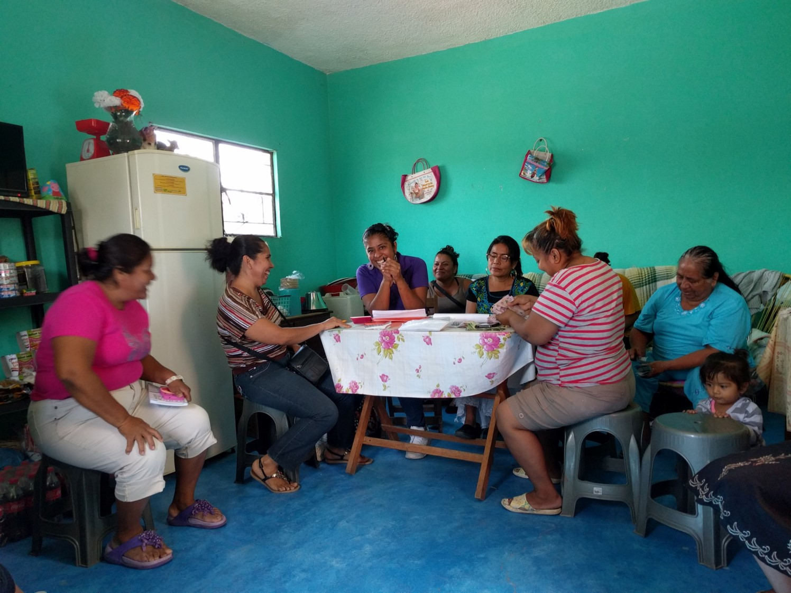

class: title-slide, inverse, center, middle

```{r setup, include=FALSE}
knitr::opts_chunk$set(echo = FALSE,
                      warning = F,
                      message = F,
                      fig.path = "figures/")

library(tidyverse)
library(sandwich)
library(estimatr) # regresión con errores robustos y agrupados
library(modelsummary) # para hacer tablas
library(ri2) # inferencia por aleatorización


xfun::pkg_load2(c('base64enc', 'htmltools', 'mime'))
```

```{css, echo = FALSE}
.huge .remark-code { /*Change made here*/
  font-size: 200% !important;
}
.tiny .remark-code { /*Change made here*/
  font-size: 60% !important;
}
```

.title[
# Uso de R para la evaluación de impacto
]
.subtitle[
### Una aplicación del Proyecto Esperanza en Oaxaca
]
<br/>

.author[
### Irvin Rojas <br> [rojasirvin.com](https://www.rojasirvin.com/) <br> [<i class="fab fa-github"></i>](https://github.com/rojasirvin) [<i class="fab fa-twitter"></i>](https://twitter.com/RojasIrvin) [<i class="ai ai-google-scholar"></i>](https://scholar.google.com/citations?user=FUwdSTMAAAAJ&hl=en)
]

<br/>

.affiliation[
### Centro de Investigación y Docencia Económicas <br> División de Economía  <br>  <br> Actualización: `r Sys.Date()`
]

**Simposio - Taller _Uso y aplicación de R en estudios sociales, económicos y de innovación_**

---

.center[
```{r}
knitr::include_graphics("intro.png")
``` 
]

---

# Agenda

1. La evaluación de impacto en ciencias sociales

1. Aplicación del Proyecto Esperanza

  - Formulación de la hipótesis

  - Diseño e implementación del estudio

  - Metodología

  - Resultados
  
1. ¿Por qué usar R en evaluación?

1. Reflexiones finales


---

class: inverse, middle, center

# La evaluación de impacto en ciencias sociales

---

# ¿Por qué evaluar?

Comprobar la teoría económica

Efectividad de políticas públicas

Competencia por fondos

Introducción de productos y servicios

---

# Causalidad y evaluación de políticas

Los diseños experimentales han puesto pie firme como el *gold standard* para la evaluación de políticas

Los investigadores pelean por fondos de gobiernos, ONGs y *think tanks* para evaluar políticas realizando asignaciones experimentales de tratamientos

Esther Duflo, Michael Kremer y Abhijit Banerjee ganaron el Nobel de Economía en 2019 por sus contribuciones a la lucha contra la pobreza, donde los experimentos tienen un papel primordial

El modelo de causal de Rubin o de *resultados potenciales* permite conceptualizar la mayoría de los problemas de evaluación pensando en qué *resultado* obtendría una unidad con y sin intervención

Sin embargo, el **problema fundamental de la inferencia causal** implica que solo podemos observar a cada unidad en uno de los estados posibles

---

# La revolución de la credibilidad

La atención pasa de *el modelo* a *la relación causal*

<br/>

Diseño de estrategias empíricas que buscan emular lo que hubiera sido un experimento

<br/>

Énfasis en *la estrategia de identificación*

<br/>

La econometría por sí sola no da la identificación

<br/>

Incluso la econometría más refinada no resuleve el problema de un mal diseño

<br/>


---

# Nobel de Economía 2021 para Card, Angrist e Imbens


.pull-left[

```{r, echo=FALSE, out.width="50%", fig.cap="Fuente: [Sitio oficial del Premio Nobel](https://www.nobelprize.org/prizes/economic-sciences/2021/summary/)", fig.align = 'center'}
knitr::include_graphics("http://rioarriba.mx/public/images/articulos/article-2a85ae1c4138f859e0fbd745501a1f4e.jpg")
```
]

.pull-right[
Usar la teoría económica para plantear relaciones causales de interés y diseñar estrategias que permitan aislar las relaciones causales, una a la vez

Contribuciones a varios niveles

- Compración y contrastación de la teoría

- Diseño de estrategias para estimar relaciones causales

- Refinamiento estadístico de los métodos que usamos

Si falta un elemento, los otos dos no se sostienen solos
]

---

class: inverse, middle, center

# Aplicación del Proyecto Esperanza

---

class: inverse, middle, center

# 1. Formulación de una hipótesis

---

# La esperanza importa

Banerjee et al. (2015): las microfinanzas pueden funcionar para algunos, pero no para todos

Duflo (2012): la esperanza importa

Multiples lecciones de la economía del comportamiento

- Sistemas duales
- Puntos de referencia y aversión a la pérdida
- Carencia de auto control
- Normas

En esta presentación hablaré sobre un estudio basado en estas ideas

Rojas, Wydick and Lybbert (2021), [Can hope elevate microfinance? Evidence from Oaxaca, Mexico]((https://academic.oup.com/oep/article/74/1/236/6154385?login=true)), *Oxford Economic Papers*

---

# Un modelo de la esperanza

Concepto de esperanza de la teoría de Snyder (1993)

- Aspiraciones

- Avenidas

- Habilidades

Diferencia a la esperanza *deseosa* de la **esperanza aspiracional**

Operacionalizamos estos conceptos en un modelo microeconómico

- Aspiraciones: modeladas con una función de utilidad que depende de un punto de referencia (aspiración)

- Avenidas: modeladas con una función de producción con restricciones

- Habilidad: modelada con la productividad marginal del esfuerzo

Ver [Wydick y Lybbert (2018)](https://www.journals.uchicago.edu/doi/full/10.1086/696968)

---

# Modelo microeconómico

El problema de cada individuo es

$$\max_{\{e_{t}\}} U_{t+1}=E(u_{t+1})-c(e_t)$$
Sujeto a

$Y_{t+1}=\pi e_t  + \pi_{\nu} \nu_{t+1}$


$E(Y_{t+1})= \begin{cases} \pi e_t, & \text{si } e_t < \bar{e} \\ \bar{Y}, & \text{si } e_t \geq \bar{e} \\ \end{cases}$

$u=A\left(\frac{Y}{A}\right)^\frac{1}{1-\alpha} \mathcal{1}(Y<A) + A\left(\frac{Y}{A}\right)^{1-\alpha} \mathcal{1}(Y\geq A)$

$\pi \bar{e}=\bar{Y}$


$\nu_{t+1} \sim \mathcal{N}(0,\,\sigma^{2})$

$\alpha \in[0,\,1]$


---

class: inverse, middle, center

# 2. Diseño e implementación del estudio

---

# Proyecto Esperanza en Oaxacca

Colaboración con *Fuentes Libres*, una ONG cristiana

Fuentes opera en el Valle de Oaxaca y en el Istmo de Tehuantepec

En el momento del estudio tenía 52 grupos de ahorro y crédito (*bancos*)

Aleatorizamos un tratamiento en parejas de bancos que tenían características similares

- Localización
- Oficial de banco
- Tipos de negocio
- Tamaño
- Edad promedio

En cada pareja, un banco es asignado a tratamiento y otro a control

Tratamiento con tres componentes
---

# Documental *Historias de Esperanza*

.center[
<iframe width="800" height="470" src="https://www.youtube.com/embed/gAidmWKCCD0" title="YouTube video player" frameborder="0" allow="accelerometer; autoplay; clipboard-write; encrypted-media; gyroscope; picture-in-picture" allowfullscreen></iframe>
]

---

# Documental *Historias de Esperanza*

.center[
```{r}
knitr::include_graphics("screenshot_doc.jpg")
``` 
]
---

# Ejercicio de fijación de metas

.center[
```{r}

``` 
]
---

# Mini curso de fijación de conceptos

.center[
```{r out.width="80%"}

``` 
]


---

# Valle de Oaxaca

.pull-left[
```{r}
knitr::include_graphics("http://oaxacahope-project.weebly.com/uploads/8/0/9/9/80995658/groups-map-a-comp_orig.jpg")
```
]

.pull-right[
```{r}
knitr::include_graphics("http://oaxacahope-project.weebly.com/uploads/8/0/9/9/80995658/groups-map-b-comp_orig.jpg")
```

]


---

# Istmo de Tehuantepec


.pull-left[
```{r}
knitr::include_graphics("http://oaxacahope-project.weebly.com/uploads/8/0/9/9/80995658/groups-map-d-comp_orig.jpg")
```
]

.pull-right[
```{r}
knitr::include_graphics("http://oaxacahope-project.weebly.com/uploads/8/0/9/9/80995658/groups-map-c-comp_orig.jpg")

knitr::include_graphics("http://oaxacahope-project.weebly.com/uploads/8/0/9/9/80995658/groups-map-e-comp_orig.png")
```

]

---

# Datos

Se recolecataron datos de cada socia en tres puntos del tiempo

- En la línea base
- Un mes después de la intervención
- Un año después de la intervención

Construimos índices de cada una de las dimensiones de la esperanza

Por ejemplo, para el índice de agencia, pedimos a cada socia que evaluara del 0 al 10 las siguientes expresiones:
- ¿Qué tan importante es el trabajo duro para los negocios?
- ¿Qué tan importante es la suerte para los negocios?
- Mi futuro está determinado por mis propias acciones y no por las de otros
- Es difícil para personas como yo ser líderes en la comunidad
- Mujeres como yo pueden tener un impacto positivo en nuestra comunidad

Recolectamos información sobre los negocios de las socias

Tuvimos acceso a registros administrativos sobre ahorro y crédito

---

class: inverse, middle, center

# 3. Metodología

---

# Integridad del diseño

Para obtener un estimador consistente del efecto del tratamiento se debe cumplir que aquellas socias que recibieron la intervención son estadísticamente iguales a las socias que no la recibieron

Se colectaron las siguientes características en la línea base y se verificó que fueran estadísticamente iguales entre el grupo tratado y el de control

.pull-left[
**Características predeterminadas**
- Edad
- Educación
- Religión
- Número de hijos
- Líder del grupo
- Tipo de negocio
]

.pull-right[
**Variables de resultados**
- Índice de aspiraciones
- Índice de agencia
- Índice de avenidas
- Felicidad
- Optimismo
- Orientación al futuro
- Aversión al riesgo
- Horas trabajadas
- Ventas
- Ganancias
- Ahorros
- Empleados

]

---

# Efecto del tratamiento

Si la aleatorización fue exitosa, el efecto del tratamiento puede obtenerse comparando las variables de resultados entre el grupo de tratamiento y control, usando los datos de seguimiento, un año después de la intervención

Lo anterior puede ser realizado con una regresión

$$y_{ij}=\alpha + \tau HopeGroup_j + X_i'\beta + \gamma D_p + \varepsilon_{i,t}$$
donde

$y_{ij}$ es la variable de impacto

$HopeGroup_j$ toma el valor de uno para las socias en el grupo de tratamiento y cero para las del grupo de control

$X_i$ son las características predeterminadas (ayudan a mejorar la precisión de la estimación)

$D_p$ es un indicador de las parejas

Los errores estándar están agrupados a nivel banco


---

# ANCOVA

[McKenzie (2015)](https://www.sciencedirect.com/science/article/pii/S030438781200003X) estudia las implicaciones de recabar y analizar datos cuando las variables de impacto no tienen una alta correlación serial

Con baja correlación serial, un estimador ANCOVA incrementa la precisión (entre [otros beneficios](https://blogs.worldbank.org/impactevaluations/collecting-more-rounds-of-data-to-boost-power-the-new-stuff))

En el análisis extendemos la ecuación a estimar como

$$y_{ij}=\alpha + \tau HopeGroup_j + X_i'\beta + \alpha_1 y_{ij,0} + \alpha_2 My_{ij,0}+ \gamma D_p + \varepsilon_{i,t}$$

donde

$y_{ij,0}$ es el valor de la variable de impacto en la línea base


$My_{ij,0}$ es igual a 1 si el valor de la variable de impacto en la línea base es faltante y cero en otro caso

Los errores estándar están agrupados a nivel banco


---

# Inferencia por aleatorización

Es un [método para calcular los valores $p$](https://jasonkerwin.com/nonparibus/2017/09/25/randomization-inference-vs-bootstrapping-p-values/) en una prueba de hipótesis

En un experimento, sabemos qué unidades son asignadas a tratamiento y control y por medio de qué mecanismo

Inferencia por aleatorización considera **qué hubiera pasado** bajo **todas** las posibles asignaciones aleatorias, no solo la que se llevó a cabo en el experimento

El procedimiento se basa en la idea de que el efecto observado. $\beta_T$, puede ser debido no al tratamiento, sino simplemente a qué grupos fueron asignados a tratamiento y a control

Algoritmo:

2. Reasignar el tratamiento con el mismo procedimiento que como ocurrió en el experimento
3. Reestimar $\beta_{T,s}$ con la asignación de 1
4. Repetir 1 y 2 $S$ veces (1,000 quizás)
5. Comparar $\beta_T$ con la distribución de los $\beta_{T,s}$ y preguntárnos, ¿qué tan común o anormal es el $\beta_T$ estimado con la muestra del experimento?

---

class: inverse, middle, center

# 4. Resultados

---

# Un vistazo a los efectos del tratamiento


```{r}
knitr::include_graphics("http://oaxacahope-project.weebly.com/uploads/8/0/9/9/80995658/ancova-combined_orig.png")
```

Nota: Efectos en las variables de impacto estandarizadas

---

# Resumen de los resultados

Los datos respaldan la hipótesis de una función de utilidad que depende de las aspiraciones (ver artículo)

Hay un efecto positivo del tratamiento sobre las aspiraciones en el corto plazo

La agencia y las agenidas responden lentamente, pero se desplazan significativamente después de un año

Hay un efecto del tratamiento sobre el índice de desempeño de negocios (explicado por el número de empleados)

Hay un efecto significantivo del tratamiento en la sobrevivencia de los bancos (ver artículo)

---

# El balance

Para estimar de forma consistente el efecto del tratamiento debe suceder que la asignación al tratamiento sea independiente de las características de las socias en la línea base

Veamos la media de la educación de quienes recibieron y no recibieron el tratamiento


Podemos hacer uso de una regresión lineal para hacer exactamente lo mismo

$$educ_i=\gamma_0 + \gamma_1 HopeGroup_i + e_i$$

---

# El balance

```{r echo=F, cache=T}
data <- haven::read_dta("data/analysis_dataset.dta")

bl <- data %>% 
  filter(t==0) 

models <- list()

models[['Edad']] <- lm_robust(age ~ hopegroup,
                                   clusters = communitybank,
                                   se_type = "CR0",
                                   data = bl)

models[['Educación']] <- lm_robust(educ ~ hopegroup,
                         clusters = communitybank,
                         se_type = "CR0",
                         data = bl)


models[['Prop. evangélica']] <- lm_robust(evangelical ~ hopegroup,
                         clusters = communitybank,
                         se_type = "CR0",
                         data = bl)
models[['Hijos']] <- lm_robust(children ~ hopegroup,
                         clusters = communitybank,
                         se_type = "CR0",
                         data = bl)
models[['Líder']] <- lm_robust(bankleader ~ hopegroup,
                         clusters = communitybank,
                         se_type = "CR0",
                         data = bl)

```


```{r echo=F, eval=T}
modelsummary::modelsummary(models,
                           statistic = "std.error",
                           coef_map = c('(Intercept)' = 'Media',
                                        'hopegroup' = "Hope Group"),
                           gof_omit = 'RMSE|N|DF|Deviance|R2|AIC|BIC',
                           stars=c('*' = .1, '**' = .05, '***'=0.01),
                           shape = model + statistic ~ term,
                           title = "Balance de características observables en línea base")

```
---

# El efecto del tratamiento

Si el supuesto de independencia se cumple, el efecto del tratamiento en una variable $y$ puede ser identificado simplmente al comparar $y$ para tratados y no tratados **después de la intervención**

Sabemos que podemos hacer esto con una regresión como sigue

$$y_{ij}=\alpha + \tau HopeGroup_j + X_i'\beta + \alpha_1 y_{ij,0} + \alpha_2 My_{ij,0}+ \gamma D_p + \varepsilon_{i,t}$$

donde $X_i$ representa un vector de características que explican $y_i$, pero que no fueron afectadas por el tratamiento

```{r echo=F, eval=T, results=F, cache=TRUE}
effects <- list()

effects[['Aspiraciones']] <- lm_robust(StdAnderAspIndex ~ hopegroup:followup1 + hopegroup:followup2 + followup2 +
                              age + educ + evangelical + children + children_under_18 + bankleader + Dwelling_Index +
                          factor(pair_number) + factor(type_of_business) +
                          Baseline_StdAnderAspIndex +
                          M_Baseline_StdAnderAspIndex,
                        clusters = communitybank,
                        se_type = "stata",
                        data = filter(data,t!=0))

effects[['Agencia']] <- lm_robust(StdAnderAgencyIndex ~ hopegroup:followup1 + hopegroup:followup2 + followup2 +
                              age + educ + evangelical + children + children_under_18 + bankleader + Dwelling_Index +
                          factor(pair_number) + factor(type_of_business) +
                          Baseline_StdAnderAgencyIndex +
                          M_Baseline_StdAnderAgencyIndex,
                        clusters = communitybank,
                        se_type = "stata",
                        data = filter(data,t!=0))


effects[['Avenidas']] <- lm_robust(StdAnderAveIndex ~ hopegroup:followup1 + hopegroup:followup2 + followup2 +
                              age + educ + evangelical + children + children_under_18 + bankleader + Dwelling_Index +
                          factor(pair_number) + factor(type_of_business) +
                          Baseline_StdAnderAveIndex +
                          M_Baseline_StdAnderAveIndex,
                        clusters = communitybank,
                        se_type = "stata",
                        data = filter(data,t!=0))

effects[['Hope 3']] <- lm_robust(StdAnderHope3Index ~ hopegroup:followup1 + hopegroup:followup2 + followup2 +
                              age + educ + evangelical + children + children_under_18 + bankleader + Dwelling_Index +
                          factor(pair_number) + factor(type_of_business) +
                          Baseline_StdAnderHope3Index +
                          M_Baseline_StdAnderHope3Index,
                        clusters = communitybank,
                        se_type = "stata",
                        data = filter(data,t!=0))

effects[['Negocios']] <- lm_robust(StdAnderBPIndex ~ hopegroup:followup1 + hopegroup:followup2 + followup2 +
                              age + educ + evangelical + children + children_under_18 + bankleader + Dwelling_Index +
                          factor(pair_number) + factor(type_of_business) +
                          Baseline_StdAnderBPIndex +
                          M_Baseline_StdAnderBPIndex,
                        clusters = communitybank,
                        se_type = "stata",
                        data = filter(data,t!=0))
```

---

# El efecto del tratamiento

Efectos positivos en los componentes del índice de esperanza después de 1 y 12 meses

Nuestro experimento nos permite capturar parte de la dinámica del movimiento en los componentes de la esperanza

Efectos positivos en el desempeño de los negocios después de 12 meses


```{r echo=F, eval=T}
modelsummary::modelsummary(effects,
                           statistic = "std.error",
                           coef_map = c('hopegroup:followup1' = "Efecto de tratamiento (1 mes)",
                             'hopegroup:followup2' = "Efecto de tratamiento (12 meses)"),
                           gof_omit = 'RMSE|N|DF|Deviance|R2|AIC|BIC|Std.Errors',
                           stars=c('*' = .1, '**' = .05, '***'=0.01),
                           title = "Efectos de tratamiento después de 1 y 12 meses")

```


---

# Inferencia por aleatorización

Declaramos la estructura del experimento

- Clusters: bancos
- Bloques: parejas

La función *conduct_ri* realiza la asignación y la estimación en cada una de las $s$ repeticiones

```{r echo=T, eval=F}
set.seed(322)

df <- filter(data, t!=0)

declaration <- 
  with(df,{
    declare_ra(
      blocks = pair_number, # bloques = parejas
      clusters = id_g, # clusters o grupos = bancos
      )
  })


declaration

ri <- conduct_ri(
  StdAnderAgencyIndex ~ hopegroup*followup1 + hopegroup*followup2 + followup2 ,
  assignment = "hopegroup",
  sharp_hypothesis = 0,
  declaration = declaration,
  data = df,
  sims = 1000
)

summary(ri)
```

El valor $p$ es de 0.077

Esto contrasta con el valor $p$ obtenido de forma tradicional de 0.06

---

class: inverse, middle, center

# ¿Por qué usar R en evaluación?

---

# Aprender a usar R como una herramienta

Transparencia en las decisiones
 - Limpieza de datos
 - Erróres estándar
 - Especificaciones

Adaptación al código de técnicas nuevas por una comunidad abierta

Combinación del análisis con la producción de reportes
  - *bookdown* para libros o artículos
  - *blogdown* para páginas web
  - *xaringan* para presentaciones (como esta que están viendo)
  - *shiny* para tableros en internet

Integración con herramientas de control de versiones, como GitHub
 - Colaboración en equipos
 - Transparencia y reproducibilidad

---

class: inverse, middle, center

# Reflexiones finales

---

# Reflexiones finales

1. Evaluar es importante

1. Conozcan su teoría

1. Cuiden su diseño

1. Conozcan sus herramientas

---

class: center, middle, inverse

# ¡Gracias!

.author[
### [rojasirvin.com](https://www.rojasirvin.com/) <br> [<i class="fab fa-github"></i>](https://github.com/rojasirvin) [<i class="fab fa-twitter"></i>](https://twitter.com/RojasIrvin) [<i class="ai ai-google-scholar"></i>](https://scholar.google.com/citations?user=FUwdSTMAAAAJ&hl=en)
]

<br/>

<br/>


Presentación creada usando el paquete [**xaringan**](https://github.com/yihui/xaringan) en R.

El chakra viene de [remark.js](https://remarkjs.com), [**knitr**](https://yihui.org/knitr/), y [R Markdown](https://rmarkdown.rstudio.com).
